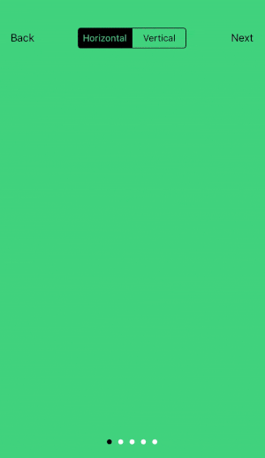
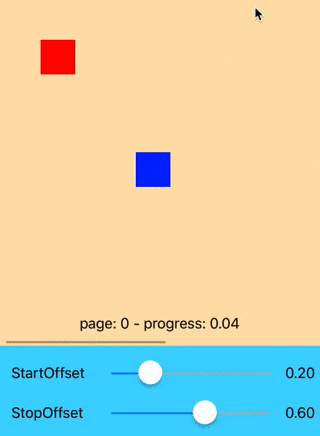
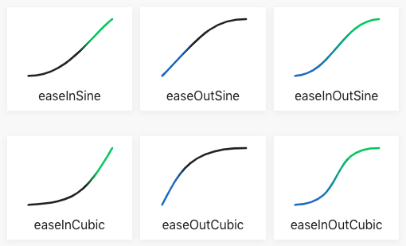
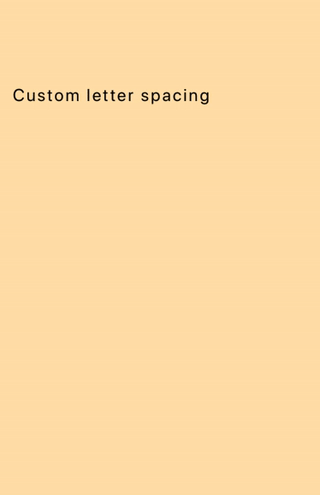
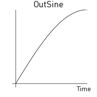

* [Installation](#installation)
* [Requirements](#requirements)
* [Concept](#concept)
* [How to use](#how-to-use)
* [More](#more)
    * [Action parameters](#action-parameters)
    * [Timing function](#timing-function)
    * [Action group](#action-group)
    * [Reverse a sequence of actions](#reverse-a-sequence-of-actions)
    * [Relative point and size](#relative-point-and-size)
* [Customization](#customization)
    * [Customize action](#customize-action)
    * [Customize timing function](#customize-timing-function)
* [Documentation](#documentation)
* [Contributing](#contributing)
* [License](#license)

## Installation

#### Using [CocoaPods](https://cocoapods.org)
Edit your `Podfile` and specify the dependency:

```ruby
pod 'PVView', '~> 1.0.4'
```
## Requirements
* iOS 9.0+
* Swift 5

## Concept


- `PVItemType` presents a parallax item
- `PVActionType` presents an action of an item
- `PVView` is separated by pages
- Each page contains a set of `PVItemType`, and `PVView` only updates actions of items on the current page
- On a page, each `PVItemType` has a set of `PVActionType`
- All `PVActionType` are updated by **progress**. **Progress** in a page is always in **[0...1]** range
- An action may has `startOffset` and `stopOffset`. These parameters describe offsets on a page where the action will begin and finish. (0 <= `startOffset` < `stopOffset` <= 1)

## How to use

**1.** Import `PVView` in proper place.

```swift
import PVView
```

**2.** Create parallax item by implementing `PVItemType` protocol.

```swift
enum YourItem: String, PVItemType {
    case item1
    case item2

    var identifier: String {
        return self.rawValue
    }
}
```
**3.** Set `PVView`'s delegate and implement `PVViewDelegate` protocol
#### Required delegate methods
There are 4 required methods of `PVViewDelegate` that you have to implement
- Specify how many pages in `PVView` by implementing
```swift
func numberOfPages(in parallaxView: PVView) -> Int {
    return 2
}
```
- Specify what items on a page by implementing

```swift
func parallaxView(_ parallaxView: PVView, itemsOnPage pageIndex: Int) -> [PVItemType] {
    return [YourItem.item1, .item2]
}
```

- Then `PVView` will ask you what view will be attached to the item via:
```swift
func parallaxview(_ parallaxView: PVView, viewForItem item: PVItemType) -> UIView
```
> **Note**: The view that is returned from this method will be cached for the item, and this method is only called when there is no view existed for the item in the cache

- Finally, specify what actions will be run on an item by implementing:

```swift
func parallaxView(_ parallaxView: PVView, actionsOfItem item: PVItemType, onPage pageIndex: Int) -> [PVActionType] {
        if pageIndex == 0 {
            return [PVActionMove(fromOrigin: PVPoint(x: 50, y: 200), toOrigin: PVPoint(x: 250, y: 200))]
        }
        return []
    }
```
> **Note:** In these methods, you can use `currentPageIndex` property of `PVView` to get index of page before the transition.

#### Optional delegate memthods
- `PVView` supports both horizontal or vertical scrolling. Specify scroll direction of `PVView` by implementing below method (*default will be horizontal*):
```swift
func direction(of parallaxView: PVView) -> PVView.PVDirection
```

- View of `PVItemType` will be automatically added as a subview of `PVView` by default. You can specify a container view for a view of `PVItemType` by implementing this method (*return nil means container view is `PVView`*)
```swift
func parallaxView(_ parallaxView: PVView, containerViewForItem item: PVItemType, onPage pageIndex: Int) -> UIView?
```

- Before transition to a new page, `PVView` will call below method, it is your chance to do something before appearing the new page (*ex: adding some animations on previous items or hiding/showing some views...*)
```swift
func parallaxView(_ parallaxView: PVView, willBeginTransitionTo pageIndex: Int)
```

- After finish transition to a new page, `PVView` will call below method, it is your chance to do something after appearing the new page (*ex: setup initial state for actions of items...*)
```swift
func parallaxView(_ parallaxView: PVView, didEndTransitionFrom previousPageIndex: Int?)
```

- The last delegate method is:
```swift
func parallaxView(_ parallaxView: PVView, didUpdate pageProgress: Double, onPage pageIndex: Int)
```
This method is called continuously during scrolling to report progress in a page

**4.** Starting `PVView`

```swift
parallaxView.reload()
```
## More
#### Action parameters
Action's parameters is present by `PVParameters`
- `startOffset`: offset on page where the action will start at
- `stopOffset`: offset on page where the action will stop at
- `timingFunction`: an object that calculates action's progress base on a page progress

Example: 



`startOffset` = 0.2, `stopOffset` = 0.6. The action will be started at progress = 0.2 and stoped at progress = 0.6

#### Timing function



There is a built-in function called `PVTimingFunction`. It is same as `CAMediaTimingFunction` but provide us the `evaluate` method to calculate action's progress

You can init a `PVTimingFunction` by name that was defined in `PVTimingFunctionName`

To understand about those function names, please take a look at [Ease functions](https://easings.net/en)

#### Action group
`PVActionGroup` presents a group of actions. Parameters of an action in the group is the parameters of the group.

Because `PVActionGroup` is a `PVActionBasicType`, so you can easily reverse all actions in the group by calling `reverse` method of the group

#### Reverse a sequence of actions
Sometime you want to reverse all actions in a sequence. There is a built in method can help:
```swift
public extension Sequence where Element: PVActionBasicType {
    func reversedActions(with newParameters: PVParameters = .default) -> [Element] {
        return self.map { $0.reverse(with: newParameters) }
    }
}
```
#### Relative point and size
You can create an action with relative points using `PVPoint`, absolute point will be calculated base on size of the container view
```swift
PVActionMove(fromPosition: PVPoint(x: 2, y: 0.2, isRelative: true)
```

You can create an action with relative sizes using `PVSize`, absolute size will be calculated base on size of the container view
```swift
PVActionSize(from: PVSize(width: 0.2, height: 0.2, isRelative: true),
             to: PVSize(width: 0.4, height: 0.4, isRelative: true))
```

## Customization
#### Customize action



You can easy custom any actions you want by implementing `PVActionType`
```swift
public protocol PVActionType {
    func update(_ progress: Double, target: UIView)
}
```

or implement `PVActionBasicType` that is inherited from `PVActionType`

```swift
public protocol PVActionBasicType: PVActionType {
    var parameters: PVParameters { get }
    func step(_ progress: Double, target: UIView)
    func reverse(with newParameters: PVParameters) -> Self
}
```

Example: I wrote a custom action called `LetterSpacingAction`. This action will change spacing of characters in a `UILabel`:

```swift
struct LetterSpacingAction: PVActionBasicType {
    let parameters: PVParameters
    let fromSpacing: Double
    let toSpacing: Double
    let maxWidth: CGFloat
    init(fromSpacing: Double, toSpacing: Double, maxWidth: CGFloat, parameters: PVParameters = .default) {
        self.fromSpacing = fromSpacing
        self.toSpacing = toSpacing
        self.maxWidth = maxWidth
        self.parameters = parameters
    }
    
    func step(_ progress: Double, target: UIView) {
        guard let label = target as? UILabel else { return }
        let current = fromSpacing + (toSpacing - fromSpacing) * progress
        label.attributedText = NSAttributedString(string: label.text ?? "", attributes: [.kern : current])
        label.frame = CGRect(origin: label.frame.origin, size: label.sizeThatFits(CGSize(width: maxWidth, height: CGFloat.greatestFiniteMagnitude)))
    }
    
    func reverse(with newParameters: PVParameters) -> LetterSpacingAction {
        return LetterSpacingAction(fromSpacing: toSpacing,
                                   toSpacing: fromSpacing,
                                   maxWidth: maxWidth,
                                   parameters: newParameters)
    }
}
```

#### Customize timing function
You can create any timing functions by implementing `PVTimingFunctionType`
```swift
public protocol PVTimingFunctionType {
    func evaluate(_ input: Double) -> Double
}
```

Example: Creating an **EaseOutSine** function:



```swift
struct EaseOutSineFunction: PVTimingFunctionType {
    func evaluate(_ input: Double) -> Double {
        return sin(input * Double.pi / 2)
    }
}
```
## Documentation
Coming soon...😅

## Contributing
This is an open source project, i can't wait to see a lot of your awesome ideas 😘

## License
This code is distributed under the terms and conditions of the [MIT license](LICENSE).
